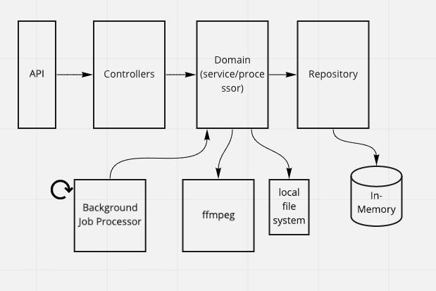

# Video Concatenation Service

A service for concatenating video files using Node.js and AWS services.

## Prerequisites
### Development Tools
- Node.js (>= 18)
- npm (>= 9)
- Docker (>= 20.10.0)
- Docker Compose V2
- Make

### For Local Testing
- Terraform (>= 1.0.0)
- AWS CLI
- curl
- PostgreSQL client (psql)

## Running the Application

### Using Make (Recommended)
```bash
# Run tests
make test

# Install, build and start everything
make setup

# Start the API service
make start-api

# Start in detached mode
make start-api-d

# Stop the API service
make stop-api
```

The API will run on port 8000.

### Local OS Setup (Alternative)
1. Install OS-level dependencies:
```bash
# macOS
brew install ffmpeg

# Ubuntu/Debian
sudo apt-get update && sudo apt-get install -y ffmpeg

# CentOS/RHEL
sudo yum install -y ffmpeg
```

2. Install dependencies:
```bash
npm install
```

3. Start the application:
```bash
npm start
```

## Project Structure
- `/src` - Application source code
- `/tests` - Test files and configurations
- `/terraform` - Infrastructure as Code
- `/scripts` - Utility scripts
- `Makefile` - Development workflow automation

## Documentation
- [Infrastructure Setup](./terraform/README.md)
- [Testing Guide](./test/README.md)
- API Doco - TODO via swagger or other

## API Call Flow
```
POST /jobs
{
    "sourceVideoUrls": ["<url to mp4>", "<url to another mp4>"],
    "destination": {
        "directory": "<local path of directory that'll store merged file>"
    }
}
```

returns
```
{
    "id": "<job id>"
    "status": "<url to status of job>"
}
```

```
GET /job/{jobId}/status
```

returns
```
{
    "status": "pending"
}
```

## Architecture

